# Bandplaner

> 🇬🇧 This README is also available [in English](README.md).

**Bandplaner ist eine selbstgehostete, quelloffene Software zur Bandorganisation.** Proben und Auftritte, wer wann kann, das Repertoire mit Tonart und Noten, Setlisten, Equipment und Packlisten, die Bandkasse, Auftrittsorte und geteilte Dateien – alles an einem Ort, statt über E-Mail, WhatsApp-Gruppen und Tabellen verstreut. Läuft auf deinem eigenen Server, einem NAS oder einem Raspberry Pi; keine Cloud, kein Abo, deine Daten bleiben bei dir.

Basiert auf Next.js und SQLite, paketiert als einzelner Docker-Container. Oberfläche auf Deutsch und Englisch.

## Über die App

Ein Benutzerkonto kann Mitglied in mehreren Bands sein und zwischen diesen wechseln. Innerhalb jeder Band gilt ein Rollenmodell: **Administrator:in** (volle Rechte inkl. Mitglieder- und Rollenverwaltung), **Mitglied** sowie **Gast/Aushilfe** mit zeitlich befristetem Zugriff (`Zugriff bis`-Datum). Neue Mitglieder und Gäste werden per Einladungslink hinzugefügt. Die freie Selbstregistrierung ist standardmäßig deaktiviert – nur das erste Konto und eingeladene Personen können sich registrieren; für offene Registrierung `REGISTRATION_ENABLED=true` setzen (siehe [INSTALLATION.de.md](INSTALLATION.de.md)).

Davon unabhängig lassen sich beliebig viele Personen als **Finanzadmin:in** kennzeichnen – bewusst losgelöst von der Rolle, damit dieselbe Person gleichzeitig Admin und Finanzadmin sein kann (Personalunion) und mehrere Personen die Finanzen betreuen können. Finanzadmin:innen sehen als Einzige die vollständige Finanzübersicht und erhalten zusätzlich admin-gleiche Rechte bei Songs, Equipment, Dateien und Terminen – aber keinen Zugriff auf Mitgliederverwaltung oder die Verwaltungsseite.

Die Anmeldung erfolgt wahlweise mit E-Mail-Adresse oder Benutzernamen. Alle Nutzer:innen können ihr Passwort im Profil selbst ändern; Admins können außerdem ein neues Initialpasswort für ein Mitglied vergeben, das dieses beim nächsten Login ändern muss. Nach 5 fehlgeschlagenen Loginversuchen in Folge wird ein Konto für 2 Tage automatisch gesperrt (Schutz gegen Brute-Force-Versuche); die Sperre läuft danach von selbst ab oder wird durch einen Admin-Passwort-Reset sofort aufgehoben.

Die Oberfläche ist auf Deutsch und Englisch verfügbar, umschaltbar über einen Sprachwähler im Kopfbereich. Die Wahl wird dauerhaft im Benutzerprofil gespeichert und gilt bandübergreifend; vor dem Login erkennt die App die Sprache automatisch aus den Browser-Einstellungen.

Eine bebilderte, englischsprachige Bedienungsanleitung für Endnutzer:innen ist über das Info-Symbol (ⓘ) in der Kopfzeile jeder Seite verlinkt (Anleitung, Link zum Quellcode-Repository, Lizenzhinweis und aktuelle App-Version) und liegt als eigenständige HTML-Datei unter [public/docs/handbook/index.html](public/docs/handbook/index.html).

Aktuell umgesetzte Module:

- **Kalender & Termine** – Proben, Auftritte, Meetings und sonstige Termine inkl. Terminserien; je Terminart vorbelegter Teilnehmerkreis (bei Proben/Auftritten standardmäßig alle Mitglieder, bei Meetings nur die erstellende Person), individuell anpassbar. Abonnierbar als ICS-Feed für externe Kalender-Apps. Auftritte haben zusätzliche Detailfelder: Ankunfts-/Soundcheck-Zeit, technische Anforderungen, ein Status (Anfrage/Bestätigt/Abgesagt/Erledigt) sowie eine strukturierte **Besetzung** – ein band-weiter Rollen-Katalog (in den Bandeinstellungen gepflegt, optional mit üblicher Person je Rolle) wird beim Anlegen eines Auftritts als Startpunkt übernommen und ist dort unabhängig vom Katalog frei änderbar (Rollen hinzufügen/entfernen, Zuweisung an ein Mitglied oder Freitext für Aushilfen). Ist das Finanzmodul aktiv, zeigt der Termin zusätzlich einen aus den verknüpften Gagen/Kostenanteilen abgeleiteten Abrechnungsstatus.
- **Verfügbarkeiten** – Rückmeldung je Termin (Zusage/Absage/Vielleicht) sowie Eintragen längerfristiger persönlicher Abwesenheiten, unabhängig von konkreten Terminen.
- **Songbibliothek** – zentrale, bandweit geteilte Songs mit Metadaten (Tonart, BPM, Taktart, Dauer, Genre, Interpret bei Coversongs, Lead-Gesang/Besetzung), Song-Dokumenten (Audiodateien, Songtexte, Tabulaturen/Noten) mit je Datei einstellbarer Sichtbarkeit, externen Links sowie persönlichen Notizen je Mitglied. Die Bibliotheksübersicht hat ein Suchfeld (Titel/Interpret/Genre/Album) und eine Sortierung (Titel, Tempo, Tonart, zuletzt hinzugefügt) mit umkehrbarer Richtung. Songs durchlaufen einen Status-Workflow von „vorgeschlagen" bis „archiviert"; Vorschläge werden per Daumen-hoch/-runter mit sichtbarem Namen abgestimmt, bei einstimmigem Downvote automatisch abgelehnt. Beim Neuanlegen unterstützt ein **Anlageassistent**: Aus einer ausgewählten Audiodatei werden Titel, Interpret, Genre, Album, Erscheinungsjahr, BPM, Spieldauer und ein eingebettetes Coverbild (ID3-/Vorbis-Tags) automatisch vorbefüllt, ohne bereits ausgefüllte Felder zu überschreiben. Optional lässt sich per Knopfdruck zusätzlich online recherchieren – MusicBrainz, Discogs und Spotify werden gemeinsam abgefragt und alle Treffer als eine Liste zur Auswahl angezeigt, je mit Quelle, Metadaten (Album · Jahr · Genre) und Cover-Vorschau; das Cover ist getrennt von der Metadaten-Zeile wählbar. Die Auswahl eines Treffers ersetzt Titel/Interpret/Album/Jahr/Genre, der Assistent dient damit auch zum nachträglichen Bearbeiten eines bestehenden Songs, nicht nur zum Anlegen. Alle drei Online-Quellen sind einzeln optional konfigurierbar (siehe [INSTALLATION.de.md](INSTALLATION.de.md)) und degradieren ohne Zugangsdaten still, ohne die Song-Erfassung zu blockieren. Ein Cover lässt sich auf der Song-Bearbeiten-Seite jederzeit auch manuell setzen oder ersetzen. Ein optionales **Proben-Tracking**-Modul (Standard aus) hält je Probentermin fest, welche Songs geübt wurden – direkt zugeordnet oder aus verknüpften Setlisten – und zeigt auf der Song-Seite eine Historie „Geübt bei …".
- **Setlisten** – Zusammenstellung aus der Songbibliothek, personalisierte Kennzeichnung einzelner Einträge je Mitglied (Farbe, Notiz, Bühnen-Hinweis-Icons wie Umstimmen/Instrumentwechsel/Programmwechsel), persönliche Gesamt-Anmerkung sowie PDF-/Druckexport – auch personalisiert je Mitglied. Neben Songs lassen sich zusätzlich manuelle Einträge mit optionaler Dauer (z. B. „Pause – 15 Minuten“, wahlweise durchnummeriert oder nicht, ohne Lücke in der Zählung), bandweit sichtbare kursive Kommentarzeilen und Abschnittstrenner mit optionaler Beschriftung einfügen. Einträge lassen sich als Segue/Medley markieren (Übergang ohne Pause zum nächsten) und werden dann als zusammenhängender Block dargestellt. Farbe, Notiz und Hinweis-Icons je Eintrag kommen beim Hinzufügen aus der persönlichen Song-Notiz und lassen sich später einzeln oder gesammelt erneut damit abgleichen. Die Dokumente eines Songs sind direkt aus dem Setlist-Eintrag erreichbar, und die ganze Liste lässt sich als Klartext in die Zwischenablage kopieren. Dieselbe Setlist lässt sich mit mehreren Terminen verknüpfen (Songliste geteilt, persönliche Hinweise/Notizen je nach im Termin-Auswähler gewähltem Termin getrennt); liegt ein verknüpfter Termin in der Vergangenheit, wird die Songliste beim nächsten Änderungsversuch automatisch als „wie gespielt"-Stand eingefroren und bleibt für diesen Termin unverändert, auch wenn die (weiterhin geteilte) Liste danach weiterbearbeitet wird.
- **Equipment & Packlisten** – Katalog mit Eigentum (Band oder Einzelperson) und optional zuständiger Person, Packlisten mit Abhak-Fortschritt und Druckexport. Eine Packliste lässt sich wie Setlisten mit mehreren Terminen verknüpfen; Abhak-Status und Zuständigkeit sind dabei je Termin getrennt, und die Eintragsliste vergangener Termine wird beim nächsten Änderungsversuch analog eingefroren. Beide Module lassen sich je Band ein-/ausschalten.
- **Finanzen** – Einnahmen und Ausgaben je Band bzw. Termin, anteilige Zuordnung an Mitglieder (Gagen bzw. Kostenanteile) mit Bestätigung durch die jeweils zuständige Seite, CSV-Export. Wahlweise ohne Bandkonto (alles wird zu 100 % verteilt) oder mit Bandkonto, das nicht verteilte Restbeträge hält; im Bandkonto-Modus sind zusätzlich direkte Aus- und Einzahlungen möglich. Je Band ein-/ausschaltbar.
- **Kommunikation** – E-Mail-Benachrichtigungen zu neuen/geänderten Terminen, Songvorschlägen, neuen Dateien und eigenen Gagen/Kostenanteilen; jede Person legt im eigenen Profil je Band fest, worüber sie informiert wird. Dazu Teilen-Buttons für WhatsApp bei Terminen und Setlisten. Je Band ein-/ausschaltbar; der Mailversand benötigt zusätzlich einen konfigurierten SMTP-Server (siehe [INSTALLATION.de.md](INSTALLATION.de.md)).
- **Medienplayer** – hinterlegte Audiodateien direkt in der App abspielen. Der zuschaltbare Übungsmodus bietet Tempo von 50–150 % bei gleichbleibender Tonhöhe, Transponieren um ±12 Halbtöne unabhängig vom Tempo (bei hinterlegter Tonart wird die transponierte Zieltonart mit angezeigt) sowie einen A/B-Abschnitts-Loop mit Wellenformdarstellung, der sich auch per Ziehen mit Maus oder Finger direkt markieren lässt. Dazu Anzeige von Spielzeit/Restzeit inklusive Millisekunden sowie automatisch erkanntes Tempo (BPM), das sich mit dem Tempo-Regler mitändert und sich – weicht es vom hinterlegten Songtempo ab – auf Bestätigung in die Songdaten übernehmen lässt. Auf Knopfdruck lässt sich zusätzlich die Tonart der Datei schätzen (**Tonart-Erkennung**, eigener Unterschalter) – weicht das Ergebnis von der hinterlegten Tonart ab, fragt die App ebenso nach, ob sie übernommen werden soll; die Songdaten ändern sich nie automatisch. Der Übungsmodus bietet außerdem **gespeicherte Loop-Abschnitte** je Song (bandweit geteilt), eine **zum Song synchronisierte Klick-Spur** (Tempo aus erkanntem/hinterlegtem BPM, automatisch erkannte Downbeat-Phase, justierbarer Versatz), einen **Einzähler** von N Schlägen vor Start und jeder Loop-Wiederholung (Schlagzahl am Song hinterlegt) sowie eine automatische **Tempo-Treppe**, die das Tempo je Loop-Durchlauf stufenweise anhebt. Verlinkte YouTube- und Spotify-Quellen werden über den offiziellen Player eingebettet – dort allerdings ohne Übungsfunktionen (siehe unten). Je Band ein-/ausschaltbar.
- **Orte** – bandweiter Katalog von Veranstaltungsorten (Adresse, Ansprechpartner:in, Kontakt, Website, Fassungsvermögen, Bühne/Technik- und Anfahrt/Parken-Notizen) mit Datei-Upload je Ort und Kartendarstellung (OpenStreetMap/Leaflet, umschaltbar zwischen Straßenkarte und Satellitenbild). Die Adresse lässt sich eingeben (automatische Geokodierung über Nominatim) oder direkt auf der Karte per Klick/Ziehen setzen (automatische Rückwärts-Geokodierung ins Adressfeld); Geokoordinaten werden zusätzlich als Text angezeigt. Termine verweisen über ein einziges Ortsfeld wahlweise per Freitext, Verknüpfung zu einem bestehenden Ort oder Neuanlage eines Orts direkt beim Anlegen des Termins; verknüpfte Termine zeigen Name, Adresse und eine Kartenvorschau. Je Band ein-/ausschaltbar.
- **Dateiverwaltung** – bandinterner Dateispeicher, verknüpfbar mit Songs, Terminen, Equipment und Orten – auch mehrfach gleichzeitig (z. B. ein am Ort hinterlegter Technical Rider zusätzlich an einen konkreten Termin); Verknüpfungen lassen sich einzeln über „Bestehende Datei verknüpfen“ ergänzen bzw. gezielt wieder lösen, ohne die Datei zu löschen. Einzelne Dateien können optional über einen nicht erratbaren Link ohne Login freigegeben werden (Funktion je Band abschaltbar).
- **Bandprofil** – Genre, Kurzbeschreibung, Standort, Kontakt-E-Mail, Links zu Website/Social-Media/Streaming sowie Bandbild.
- **Benutzerprofil** – Anzeigename, E-Mail und Avatar, kontobezogen und unabhängig von der jeweiligen Bandzugehörigkeit; dazu Passwortänderung und Benachrichtigungs-Einstellungen.

Die vollständige, detailliertere fachliche Spezifikation – inklusive geplanter, noch nicht umgesetzter Erweiterungen wie Band-Chat/Umfragen/To-Dos und KI-gestützten Setlist-Vorschlägen – steht in [Funktionsspezifikation-Bandplaner.md](Funktionsspezifikation-Bandplaner.md).

## Module ein- und ausschalten

Umfangreichere Module lassen sich je Band unter **Band → Verwaltung** ein- und ausschalten, damit die Oberfläche auf das beschränkt bleibt, was die Gruppe tatsächlich nutzt:

| Modul | Standard | Hinweis |
|---|---|---|
| Equipment | ein | – |
| Packlisten | ein | benötigt Equipment |
| Finanzen | aus | wer aktiviert, wird automatisch Finanzadmin:in, falls die Band noch keine hat |
| Kommunikation | aus | E-Mail-Versand braucht zusätzlich SMTP (siehe [INSTALLATION.de.md](INSTALLATION.de.md)) |
| Medienplayer | aus | steuert nur die Wiedergabe; Dateien und Links bleiben unabhängig davon nutzbar |
| davon: Tonart-Erkennung | ein | Unterschalter, nur wirksam wenn Medienplayer aktiv ist |
| Orte | aus | ohne aktiviertes Modul bleibt bei Terminen nur ein Freitext-Ortsfeld, wie zuvor |

Ausgeschaltete Module verschwinden aus der Navigation, **löschen aber keine Daten** – alles steht unverändert wieder zur Verfügung, sobald das Modul erneut eingeschaltet wird. Einzige bewusste Ausnahme: Das Deaktivieren öffentlicher Datei-Links sperrt auch bereits bestehende Links, da es als Sicherheitsschranke gedacht ist.

## Wie die Objekte zusammenhängen

Eine Band ist der zentrale Ausgangspunkt: Fast jedes andere Objekt gehört zu genau einer Band.

```mermaid
erDiagram
    BAND }o--o{ MITGLIED : "Mitgliedschaft (Rolle)"
    BAND ||--o{ TERMIN : hat
    BAND ||--o{ SONG : hat
    BAND ||--o{ SETLISTE : hat
    BAND ||--o{ PACKLISTE : hat
    BAND ||--o{ ORT : hat
    BAND ||--o{ FINANZEINTRAG : hat
    BAND ||--o{ DATEI : hat
    BAND |o--o{ EQUIPMENT : "Band-Eigentum"

    MITGLIED |o--o{ EQUIPMENT : "persönliches Eigentum"
    MITGLIED }o--o{ TERMIN : "Verfügbarkeit"
    MITGLIED }o--o{ SONG : "Abstimmung & Notizen"
    MITGLIED }o--o{ FINANZEINTRAG : "Gage / Kostenanteil"

    TERMIN |o--o| ORT : "findet statt an"
    TERMIN }o--o{ SETLISTE : nutzt
    TERMIN }o--o{ PACKLISTE : nutzt
    TERMIN ||--o{ FINANZEINTRAG : verursacht
    TERMIN }o--o{ DATEI : hat

    SETLISTE }o--o{ SONG : "enthält (mit Reihenfolge)"

    SONG }o--o{ DATEI : hat

    PACKLISTE }o--o{ EQUIPMENT : enthält

    EQUIPMENT }o--o{ DATEI : hat

    ORT }o--o{ DATEI : hat
```



Lesehilfe:

- **Dateien** können an mehrere Stellen gleichzeitig andocken – Termin, Song, Equipment-Teil und/oder Ort, in beliebiger Kombination (oder an keine, als reine bandweite Ablage) –, statt wie früher an höchstens eine davon.
- **Equipment** gehört entweder der Band oder einer einzelnen Person, nie beidem.
- Ein **Termin** kann null oder einen Ort haben; derselbe Ort lässt sich für mehrere Termine wiederverwenden.
- **Setlisten** und **Packlisten** lassen sich mit mehreren Terminen gleichzeitig verknüpfen (oder mit keinem); die Song- bzw. Eintragsliste ist dabei geteilt, während Abhak-Status, Zuständigkeit und persönliche Hinweise je Termin getrennt gespeichert werden. Für bereits vergangene Termine wird die Liste beim nächsten Änderungsversuch automatisch als historischer Stand eingefroren, damit spätere Bearbeitungen die Dokumentation vergangener Auftritte/Proben nicht verfälschen.
- **Mitglieder** melden sich pro Termin mit ihrer Verfügbarkeit zurück, stimmen über Song-Vorschläge ab und bekommen Gagen bzw. Kostenanteile aus Finanzeinträgen zugeordnet.

*(Nicht dargestellt, um die Übersicht lesbar zu halten: Einladungen, persönliche Song-Notizen, Bühnen-Hinweise auf Setlist-Einträgen, Finanzadmin-Zuordnung.)*

## FAQ

**Ist Bandplaner kostenlos?**
Ja. Quelloffene Software unter der GNU AGPL-3.0. Kein Abo, keine kostenpflichtige Stufe, kein Konto auf einem fremden Server.

**Braucht es die Cloud oder eine Internetverbindung?**
Nein. Bandplaner wird selbst gehostet – es läuft komplett auf deinem eigenen Rechner, alle Daten bleiben dort. Die einzigen optionalen ausgehenden Aufrufe sind die Metadaten-Recherche des Anlageassistenten (MusicBrainz, Discogs, Spotify) und die Adresssuche für Orte (OpenStreetMap); beides lässt sich abgeschaltet lassen.

**Läuft es auf einer Synology DiskStation oder einem Raspberry Pi?**
Ja. Das Docker-Image ist Multi-Arch (`linux/amd64` + `linux/arm64`) und läuft damit auf x86-Servern, den meisten aktuellen Synology-/QNAP-NAS und einem Raspberry Pi 4/5.

**Ist das eine selbstgehostete Alternative zu BandHelper, Set List Maker oder Gig-o-Matic?**
Es deckt weite Teile davon ab – geteiltes Repertoire mit Tonarten, Setlisten, Terminplanung, Verfügbarkeiten und Dateien – plus einen Übungs-Player. Der Unterschied: Du hostest und aktualisierst es selbst, dafür ist es kostenlos, privat und ohne Preis pro Person.

**Wie viele Bands und Mitglieder sind möglich?**
Beliebig viele. Ein Konto kann zu mehreren Bands gehören und zwischen ihnen wechseln; jede Band hat eigene Mitglieder, ein eigenes Repertoire und eigene Einstellungen.

**Gibt es eine gehostete Version oder eine öffentliche Demo?**
Nein. Bandplaner wird ausschließlich selbst gehostet – du betreibst deine eigene Instanz. Die Einrichtung mit Docker dauert rund eine Minute (siehe unten).

**Gibt es eine Mobile-App?**
Keine native App. Die Oberfläche ist responsiv und funktioniert im Handy-Browser; per „Zum Startbildschirm hinzufügen" gibt es eine App-ähnliche Verknüpfung.

**Was ist mit DSGVO / den Daten meiner Mitglieder?**
Da du selbst hostest, bist du die verantwortliche Stelle. Bandplaner bringt einen persönlichen Datenexport und eine selbstbediente Konto-Löschung für jede Person mit.

## Bekannte Grenzen

- **Übungsfunktionen nur für hochgeladene Dateien.** Eingebettete Streaming-Quellen lassen sich nicht verlangsamen oder transponieren: Spotify bietet über seinen Player keinerlei Tempo-/Tonhöhensteuerung, YouTube nur feste Geschwindigkeitsstufen und kein Transponieren. Ein direkter Zugriff auf die Audiodaten wäre bei beiden nicht zulässig.
- **Tonart-Erkennung ist ein Näherungswert.** Das Verfahren (Chromagramm-Korrelation nach Krumhansl-Schmuckler) kann eine Dur-Tonart kaum von ihrer parallelen Molltonart unterscheiden (z. B. C-Dur/a-Moll), da beide dieselben Töne verwenden – in solchen Fällen weist die App im Ergebnis explizit auf die Alternative hin. Bei nicht tonalem Audiomaterial (reines Schlagzeug, starkes Rauschen) liefert die Erkennung dennoch ein Ergebnis, ohne dies als unsicher zu kennzeichnen.
- **Self-Service-„Passwort vergessen" nur mit E-Mail-Versand.** Der Reset per E-Mail-Link funktioniert nur, wenn ein SMTP-Server konfiguriert ist (siehe [INSTALLATION.de.md](INSTALLATION.de.md)); ohne SMTP vergeben Admins ein neues Initialpasswort (siehe oben).
- **Keine automatisch verschickten WhatsApp-Nachrichten** – das setzt zwingend ein WhatsApp-Business-Konto voraus; WhatsApp-Kanäle bieten keine Programmierschnittstelle.
- **Keine Push-Benachrichtigungen** – Benachrichtigungen laufen ausschließlich per E-Mail.

## Tech-Stack

Next.js 16 (App Router), Prisma 7 mit SQLite (`better-sqlite3`-Adapter), NextAuth (Auth.js) v5, TypeScript, Tailwind CSS.

## Lokale Entwicklung

```bash
npm install
cp .env.example .env   # Werte anpassen, siehe Kommentare in der Datei
npx prisma migrate dev
npm run dev
```

Öffne [http://localhost:3000](http://localhost:3000). Die App legt beim ersten Start ein neues Konto über `/register` an; das erste Bandmitglied wird beim Anlegen der ersten Band automatisch deren Administrator:in.

## Self-Hosting / Deployment

Für den produktiven Betrieb wird ein vorgebautes Multi-Arch-Docker-Image (amd64/arm64) unter [`ghcr.io/maxxs78/bandplaner`](https://github.com/maxxs78/bandplaner/pkgs/container/bandplaner) veröffentlicht – kein lokaler Build nötig.

Schnellstart (Details, HTTPS/Reverse-Proxy und plattformspezifische Schritte in der [Installationsanleitung](INSTALLATION.de.md)):

```bash
mkdir bandplaner && cd bandplaner
curl -fsSLO https://raw.githubusercontent.com/maxxs78/bandplaner/main/docker-compose.yml
curl -fsSL  https://raw.githubusercontent.com/maxxs78/bandplaner/main/.env.example -o .env
# .env bearbeiten: AUTH_SECRET (openssl rand -base64 32) und NEXT_PUBLIC_APP_URL setzen
docker compose up -d
```

Updates: `docker compose pull && docker compose up -d`. Datenbank-Migrationen laufen beim Start automatisch; die Daten liegen in drei benannten Volumes und überstehen Updates.

Wer den Code selbst anpassen will, baut das Image lokal – siehe [`docker-compose.build.yml`](docker-compose.build.yml) und [CONTRIBUTING.de.md](CONTRIBUTING.de.md).

## Weitere Ressourcen

- [Bedienungsanleitung (Handbook)](public/docs/handbook/index.html) – bebilderte Anleitung für Endnutzer:innen (Englisch); in der laufenden App auch über das Info-Symbol (ⓘ) in der Kopfzeile erreichbar
- [Funktionsspezifikation-Bandplaner.md](Funktionsspezifikation-Bandplaner.md) – vollständige fachliche Spezifikation inkl. Roadmap
- [Projekt-Website](https://maxxs78.github.io/bandplaner/de.html) – Überblick und Screenshots
- [INSTALLATION.de.md](INSTALLATION.de.md) – Installationsanleitung für den Selbsthost-Betrieb (Deutsch), [English](INSTALLATION.md)
- [CHANGELOG.md](CHANGELOG.md) – Änderungsprotokoll (Englisch)
- [Next.js Documentation](https://nextjs.org/docs)
- [Learn Next.js](https://nextjs.org/learn)

## Mitwirken

Bandplaner ist ein **Hobbyprojekt**, das in der Freizeit entsteht.

**Fehlerberichte und Funktionswünsche sind willkommen** – über die [Issues](https://github.com/maxxs78/bandplaner/issues) mit den bereitgestellten Vorlagen. Eine Zusage, **ob und wann** etwas umgesetzt wird, gibt es nicht.

**Pull Requests werden nicht angenommen.** Der Review-Aufwand ist für ein Ein-Personen-Hobbyprojekt nicht leistbar; PRs aus Forks werden automatisch mit Verweis auf die Issues geschlossen. Forken und unter der AGPL-3.0 selbst anpassen ist natürlich erlaubt. Details: [CONTRIBUTING.de.md](CONTRIBUTING.de.md).

Sicherheitslücken bitte vertraulich melden – siehe [SECURITY.de.md](SECURITY.de.md), **nicht** als öffentliches Issue. Umgangston: [CODE_OF_CONDUCT.de.md](CODE_OF_CONDUCT.de.md).

## Lizenz und Haftung

Bandplaner steht unter der [GNU Affero General Public License v3.0](LICENSE) (AGPL-3.0-only). Wer eine geänderte Fassung über ein Netzwerk zugänglich macht, muss deren vollständigen Quellcode den Nutzer:innen bereitstellen (AGPL § 13); bei unveränderter Nutzung genügt der Hinweis auf dieses Repository.

Die Software wird **ohne jede Gewährleistung** bereitgestellt, die **Verwendung erfolgt auf eigene Gefahr** (siehe [LICENSE](LICENSE), Abschnitte 15–17). Für produktiven Betrieb und das Hosten für Dritte liegen Sicherung, Datenschutz und Verfügbarkeit vollständig bei der betreibenden Person.
