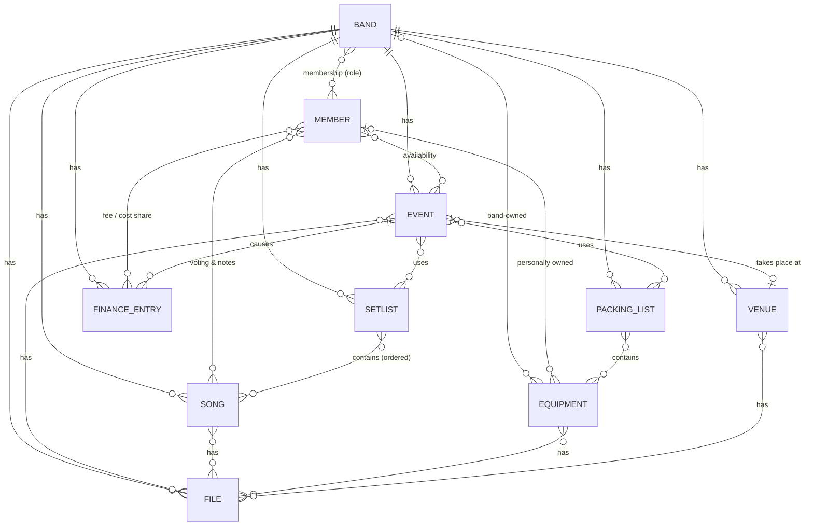

# Bandplaner

> 🇩🇪 Dieses README gibt es auch [auf Deutsch](README.de.md).

**Bandplaner is a self-hosted, open-source band management web app.** Rehearsals and gigs, who's available, the repertoire with keys and sheet music, setlists, equipment and packing lists, the band's finances, venues, and shared files — all in one place, instead of scattered across email, WhatsApp groups, and spreadsheets. It runs on your own server, a NAS, or a Raspberry Pi; there is no cloud and no subscription, and your data stays with you.

Built with Next.js and SQLite, packaged as a single Docker container. Interface in English and German.

## About the app

A user account can be a member of several bands and switch between them. Within each band there is a role model: **Administrator** (full rights including member and role management), **Member**, and **Guest/Substitute** with time-limited access (an "access until" date). New members and guests are added via an invitation link. Open self-registration is disabled by default — only the first account and invited people can register; set `REGISTRATION_ENABLED=true` for open registration (see [INSTALLATION.md](INSTALLATION.md)).

Independently of that, any number of people can be flagged as **finance admin** — deliberately decoupled from the role, so that the same person can be both administrator and finance admin, and so that several people can look after the finances. Finance admins are the only ones who see the complete financial overview, and they additionally get admin-equivalent rights for songs, equipment, files, and events — but no access to member management or the management page.

Sign-in works with either an email address or a username. All users can change their own password in their profile; admins can additionally set a new initial password for a member, which that member must change at the next login. After 5 consecutive failed login attempts an account is automatically locked for 2 days (protection against brute-force attempts); the lock then expires on its own or is lifted immediately by an admin password reset.

The interface is available in German and English, switchable via a language picker in the header. The choice is stored permanently in the user profile and applies across all bands; before login the app detects the language automatically from the browser settings.

An illustrated, English-language user handbook is linked from the info icon (ⓘ) in the header of every page (handbook, link to the source-code repository, license note, and current app version) and is also available as a standalone HTML file at [public/docs/handbook/index.html](public/docs/handbook/index.html).

Modules currently implemented:

- **Calendar & events** – rehearsals, gigs, meetings, and other events including recurring series; each event type has a pre-filled set of participants (all members for rehearsals/gigs by default, only the creator for meetings), individually adjustable. Subscribable as an ICS feed for external calendar apps. Gigs have additional detail fields: arrival/soundcheck time, technical requirements, a status (request/confirmed/cancelled/done), and a structured **lineup** – a band-wide role catalog (maintained in the band settings, optionally with a default person per role) is taken as the starting point when a gig is created and can be freely edited there independently of the catalog (add/remove roles, assign to a member or free text for substitutes). If the finance module is active, the event also shows a settlement status derived from the linked fees/cost shares.
- **Availability** – response per event (yes/no/maybe) as well as recording longer personal absences, independent of specific events.
- **Song library** – central, band-wide shared songs with metadata (key, BPM, time signature, duration, genre, artist for covers), song documents (audio files, lyrics, tabs/sheet music) with per-file visibility, external links, and personal notes per member. Songs go through a status workflow from "proposed" to "archived"; proposals are voted on with thumbs up/down under a visible name, and are automatically rejected on a unanimous downvote. When creating a song, a **new-song assistant** helps: from a selected audio file it pre-fills title, artist, genre, album, release year, BPM, playing time, and an embedded cover image (ID3/Vorbis tags) automatically, without overwriting fields that are already filled. Optionally, an online lookup can be run at the press of a button – MusicBrainz as the primary source, Discogs as a fallback for genre/year/cover, Spotify for a supplementary track link; if there are several matches, a selection list appears for confirmation. All three online sources are individually optional (see [INSTALLATION.md](INSTALLATION.md)) and degrade silently without credentials, without blocking song entry.
- **Setlists** – compiled from the song library, personalized marking of individual entries per member (color, note, stage-cue icons such as retune / instrument change / program change), a personal overall remark, and PDF/print export – also personalized per member. Besides songs, you can add manual entries with an optional duration (e.g. "Break – 15 minutes", numbered or not, without a gap in the count), band-wide visible italic comment lines, and section dividers with an optional label. The same setlist can be linked to several events (song list shared, personal cues/notes kept separate depending on the event chosen in the event picker); if a linked event is in the past, the song list is automatically frozen as an "as played" snapshot at the next edit attempt and stays unchanged for that event, even if the (still shared) list is edited further afterwards.
- **Equipment & packing lists** – a catalog with ownership (band or individual) and an optional responsible person, packing lists with check-off progress and print export. A packing list can be linked to several events like setlists; check-off status and responsibility are kept separate per event, and the entry list of past events is frozen analogously at the next edit attempt. Both modules can be enabled/disabled per band.
- **Finances** – income and expenses per band or event, proportional allocation to members (fees or cost shares) with confirmation by the responsible side, CSV export. Either without a band account (everything is distributed 100%) or with a band account that holds undistributed remainders; in band-account mode, direct payouts and deposits are also possible. Can be enabled/disabled per band.
- **Communication** – email notifications about new/changed events, song proposals, new files, and one's own fees/cost shares; each person decides in their own profile, per band, what they are notified about. Plus share buttons for WhatsApp on events and setlists. Can be enabled/disabled per band; sending mail additionally requires a configured SMTP server (see [INSTALLATION.md](INSTALLATION.md)).
- **Media player** – play stored audio files directly in the app. The optional practice mode offers tempo from 50–150% at constant pitch, transposition by ±12 semitones independent of tempo (if a key is stored, the transposed target key is shown as well), and an A/B section loop with a waveform display that can also be marked directly by dragging with mouse or finger. Plus a display of elapsed/remaining time including milliseconds, and automatically detected tempo (BPM) that follows the tempo slider and – if it differs from the stored song tempo – can be applied to the song data on confirmation. At the press of a button, the file's key can additionally be estimated (**key detection**, its own sub-toggle) – if the result differs from the stored key, the app likewise asks whether to apply it; the song data never changes automatically. Linked YouTube and Spotify sources are embedded via the official player – there, however, without practice features (see below). Can be enabled/disabled per band.
- **Venues** – a band-wide catalog of venues (address, contact person, contact details, website, capacity, stage/tech and directions/parking notes) with file upload per venue and a map view (OpenStreetMap/Leaflet, switchable between street map and satellite). The address can be entered (automatic geocoding via Nominatim) or set directly on the map by click/drag (automatic reverse geocoding into the address field); geo-coordinates are also shown as text. Events reference a venue via a single location field – either as free text, a link to an existing venue, or creating a new venue right when creating the event; linked events show name, address, and a map preview. Can be enabled/disabled per band.
- **File management** – band-internal file storage, linkable to songs, events, equipment, and venues – also to several at once (e.g. a technical rider stored at a venue additionally attached to a specific event); links can be added individually via "Link existing file" or removed selectively without deleting the file. Individual files can optionally be shared without login via an unguessable link (this feature can be disabled per band).
- **Band profile** – genre, short description, location, contact email, links to website/social media/streaming, and a band picture.
- **User profile** – display name, email, and avatar, tied to the account and independent of any band membership; plus password change and notification settings.

The complete, more detailed functional specification – including planned, not-yet-implemented extensions such as band chat / polls / to-dos and AI-assisted setlist suggestions – is in [Funktionsspezifikation-Bandplaner.md](Funktionsspezifikation-Bandplaner.md) (German).

## Enabling and disabling modules

Larger modules can be enabled/disabled per band under **Band → Management**, so that the interface stays limited to what the group actually uses:

| Module | Default | Note |
|---|---|---|
| Equipment | on | – |
| Packing lists | on | requires Equipment |
| Finances | off | whoever enables it automatically becomes a finance admin if the band has none yet |
| Communication | off | sending mail additionally needs SMTP (see [INSTALLATION.md](INSTALLATION.md)) |
| Media player | off | only controls playback; files and links remain usable regardless |
| within it: key detection | on | sub-toggle, only effective when the media player is active |
| Venues | off | without the module enabled, events keep just a free-text location field, as before |

Disabled modules disappear from the navigation but **delete no data** – everything is available again unchanged as soon as the module is re-enabled. The one deliberate exception: disabling public file links also blocks links that already exist, since it is meant as a security barrier.

## How the objects relate

A band is the central starting point: almost every other object belongs to exactly one band.



Reading aid:

- **Files** can attach to several places at once – event, song, equipment item, and/or venue, in any combination (or to none, as pure band-wide storage) – instead of at most one as before.
- **Equipment** belongs either to the band or to a single person, never both.
- An **event** can have zero or one venue; the same venue can be reused for several events.
- **Setlists** and **packing lists** can be linked to several events at once (or none); the song/entry list is shared, while check-off status, responsibility, and personal cues are stored separately per event. For events already in the past, the list is automatically frozen as a historical snapshot at the next edit attempt, so that later edits don't distort the documentation of past gigs/rehearsals.
- **Members** respond with their availability per event, vote on song proposals, and are allocated fees or cost shares from finance entries.

*(Not shown, to keep the overview readable: invitations, personal song notes, stage cues on setlist entries, finance-admin assignment.)*

## FAQ

**Is Bandplaner free?**
Yes. It is open-source software under the GNU AGPL-3.0. There is no subscription, no paid tier, and no account on anyone else's server.

**Does it need the cloud or an internet connection?**
No. Bandplaner is self-hosted — it runs entirely on your own machine and all data stays there. The only optional outbound calls are the new-song assistant's metadata lookups (MusicBrainz, Discogs, Spotify) and venue address search (OpenStreetMap); each can be left disabled.

**Can it run on a Synology NAS or a Raspberry Pi?**
Yes. The Docker image is multi-arch (`linux/amd64` + `linux/arm64`), so it runs on x86 servers, most modern Synology/QNAP NAS models, and a Raspberry Pi 4/5.

**Is it a self-hosted alternative to BandHelper, Set List Maker, or Gig-o-Matic?**
It covers much of the same ground — shared repertoire with keys, setlists, scheduling, availability, and files — with a practice player on top. The trade-off: you host and update it yourself, and in return it is free, private, and has no per-seat pricing.

**How many bands and members can I have?**
Unlimited. One account can belong to several bands and switch between them; each band has its own members, repertoire, and settings.

**Is there a hosted version or a public demo?**
No. Bandplaner is self-hosted only — you run your own instance. Setup with Docker takes about a minute (see below).

**Is there a mobile app?**
No native app. The interface is responsive and works in a phone browser; you can "Add to Home Screen" for an app-like shortcut.

**What about GDPR / my members' data?**
Since you host it, you are the data controller. Bandplaner includes a personal data export and self-service account deletion for every user.

## Known limitations

- **Practice features only for uploaded files.** Embedded streaming sources cannot be slowed down or transposed: Spotify offers no tempo/pitch control via its player, YouTube only fixed speed steps and no transposition. Direct access to the audio data would not be permitted for either.
- **Key detection is an approximation.** The method (chromagram correlation after Krumhansl-Schmuckler) can barely distinguish a major key from its relative minor (e.g. C major / A minor), since both use the same notes – in such cases the app explicitly points out the alternative in the result. For non-tonal audio material (pure drums, heavy noise) the detection still returns a result without marking it as uncertain.
- **Self-service "forgot password" only with mail delivery.** The email-link reset works only if an SMTP server is configured (see [INSTALLATION.md](INSTALLATION.md)); without SMTP, admins set a new initial password (see above).
- **No automatically sent WhatsApp messages** – that would strictly require a WhatsApp Business account; WhatsApp channels offer no API.
- **No push notifications** – notifications run exclusively via email.

## Tech stack

Next.js 16 (App Router), Prisma 7 with SQLite (`better-sqlite3` adapter), NextAuth (Auth.js) v5, TypeScript, Tailwind CSS.

## Local development

```bash
npm install
cp .env.example .env   # adjust values, see the comments in the file
npx prisma migrate dev
npm run dev
```

Open [http://localhost:3000](http://localhost:3000). On first start, create an account via `/register`; the first band member automatically becomes the administrator of the first band they create.

## Self-hosting / deployment

For production use, a prebuilt multi-arch Docker image (amd64/arm64) is published at [`ghcr.io/maxxs78/bandplaner`](https://github.com/maxxs78/bandplaner/pkgs/container/bandplaner) – no local build needed.

Quick start (details, HTTPS/reverse proxy, and platform-specific steps in the [installation guide](INSTALLATION.md)):

```bash
mkdir bandplaner && cd bandplaner
curl -fsSLO https://raw.githubusercontent.com/maxxs78/bandplaner/main/docker-compose.yml
curl -fsSL  https://raw.githubusercontent.com/maxxs78/bandplaner/main/.env.example -o .env
# edit .env: set AUTH_SECRET (openssl rand -base64 32) and NEXT_PUBLIC_APP_URL
docker compose up -d
```

Updates: `docker compose pull && docker compose up -d`. Database migrations run automatically at start; data lives in three named volumes and survives updates.

To modify the code yourself, build the image locally – see [`docker-compose.build.yml`](docker-compose.build.yml) and [CONTRIBUTING.md](CONTRIBUTING.md).

## Further resources

- [User handbook](public/docs/handbook/index.html) – illustrated guide for end users (English); also reachable in the running app via the info icon (ⓘ) in the header
- [Funktionsspezifikation-Bandplaner.md](Funktionsspezifikation-Bandplaner.md) – complete functional specification incl. roadmap (German)
- [Project website](https://maxxs78.github.io/bandplaner/) – overview and screenshots
- [INSTALLATION.md](INSTALLATION.md) – installation guide for self-hosting
- [CHANGELOG.md](CHANGELOG.md) – release notes
- [Next.js documentation](https://nextjs.org/docs)
- [Learn Next.js](https://nextjs.org/learn)

## Contributing

Bandplaner is a **hobby project**, built in spare time.

**Bug reports and feature requests are welcome** – via the [issues](https://github.com/maxxs78/bandplaner/issues) using the provided templates. There is **no guarantee whether or when** anything is implemented.

**Pull requests are not accepted.** Reviewing and taking responsibility for external code is more than a one-person hobby project can sustain; PRs from forks are closed automatically with a pointer to the issues. Forking and modifying under the AGPL-3.0 is of course allowed. Details: [CONTRIBUTING.md](CONTRIBUTING.md).

Please report security vulnerabilities privately – see [SECURITY.md](SECURITY.md), **not** as a public issue. Code of conduct: [CODE_OF_CONDUCT.md](CODE_OF_CONDUCT.md).

## License and liability

Bandplaner is licensed under the [GNU Affero General Public License v3.0](LICENSE) (AGPL-3.0-only). Anyone who makes a modified version available over a network must provide its complete source code to users (AGPL § 13); for unmodified use, a pointer to this repository is sufficient.

The software is provided **without any warranty**, and **use is at your own risk** (see [LICENSE](LICENSE), sections 15–17). For production use and hosting on behalf of others, backups, data protection, and availability are entirely the operator's responsibility.
