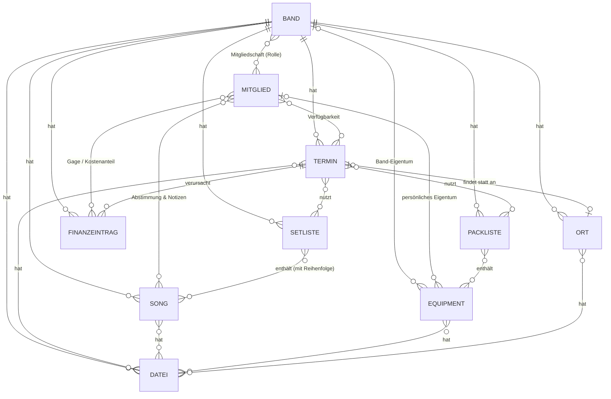

Bandplaner ist eine webbasierte Band-Organisations-App auf Basis von Next.js, Prisma und SQLite. Sie bündelt die Organisation einer Band oder Musikgruppe – Termine, Verfügbarkeiten, Repertoire, Setlisten, Dateien, Equipment und Finanzen – an einem Ort, statt sie über E-Mail, Messenger-Gruppen und Tabellen zu verstreuen.

## Über die App

Ein Benutzerkonto kann Mitglied in mehreren Bands sein und zwischen diesen wechseln. Innerhalb jeder Band gilt ein Rollenmodell: **Administrator:in** (volle Rechte inkl. Mitglieder- und Rollenverwaltung), **Mitglied** sowie **Gast/Aushilfe** mit zeitlich befristetem Zugriff (`Zugriff bis`-Datum). Neue Mitglieder und Gäste werden per Einladungslink hinzugefügt.

Davon unabhängig lassen sich beliebig viele Personen als **Finanzadmin:in** kennzeichnen – bewusst losgelöst von der Rolle, damit dieselbe Person gleichzeitig Admin und Finanzadmin sein kann (Personalunion) und mehrere Personen die Finanzen betreuen können. Finanzadmin:innen sehen als Einzige die vollständige Finanzübersicht und erhalten zusätzlich admin-gleiche Rechte bei Songs, Equipment, Dateien und Terminen – aber keinen Zugriff auf Mitgliederverwaltung oder die Verwaltungsseite.

Die Anmeldung erfolgt wahlweise mit E-Mail-Adresse oder Benutzernamen. Alle Nutzer:innen können ihr Passwort im Profil selbst ändern; Admins können außerdem ein neues Initialpasswort für ein Mitglied vergeben, das dieses beim nächsten Login ändern muss. Nach 5 fehlgeschlagenen Loginversuchen in Folge wird ein Konto für 2 Tage automatisch gesperrt (Schutz gegen Brute-Force-Versuche); die Sperre läuft danach von selbst ab oder wird durch einen Admin-Passwort-Reset sofort aufgehoben.

Die Oberfläche ist auf Deutsch und Englisch verfügbar, umschaltbar über einen Sprachwähler im Kopfbereich. Die Wahl wird dauerhaft im Benutzerprofil gespeichert und gilt bandübergreifend; vor dem Login erkennt die App die Sprache automatisch aus den Browser-Einstellungen.

Eine bebilderte, englischsprachige Bedienungsanleitung für Endnutzer:innen ist über das Info-Symbol (ⓘ) in der Kopfzeile jeder Seite verlinkt (Anleitung + aktuelle App-Version) und liegt als eigenständige HTML-Datei unter [public/docs/handbook/index.html](public/docs/handbook/index.html).

Aktuell umgesetzte Module:

- **Kalender & Termine** – Proben, Auftritte, Meetings und sonstige Termine inkl. Terminserien; je Terminart vorbelegter Teilnehmerkreis (bei Proben/Auftritten standardmäßig alle Mitglieder, bei Meetings nur die erstellende Person), individuell anpassbar. Abonnierbar als ICS-Feed für externe Kalender-Apps.
- **Verfügbarkeiten** – Rückmeldung je Termin (Zusage/Absage/Vielleicht) sowie Eintragen längerfristiger persönlicher Abwesenheiten, unabhängig von konkreten Terminen.
- **Songbibliothek** – zentrale, bandweit geteilte Songs mit Metadaten (Tonart, BPM, Taktart, Dauer, Genre, Interpret bei Coversongs), Song-Dokumenten (Audiodateien, Songtexte, Tabulaturen/Noten) mit je Datei einstellbarer Sichtbarkeit, externen Links sowie persönlichen Notizen je Mitglied. Songs durchlaufen einen Status-Workflow von „vorgeschlagen" bis „archiviert"; Vorschläge werden per Daumen-hoch/-runter mit sichtbarem Namen abgestimmt, bei einstimmigem Downvote automatisch abgelehnt. Beim Neuanlegen unterstützt ein **Anlageassistent**: Aus einer ausgewählten Audiodatei werden Titel, Interpret, Genre, Album, Erscheinungsjahr, BPM, Spieldauer und ein eingebettetes Coverbild (ID3-/Vorbis-Tags) automatisch vorbefüllt, ohne bereits ausgefüllte Felder zu überschreiben. Optional lässt sich per Knopfdruck zusätzlich online recherchieren – MusicBrainz als Primärquelle, Discogs als Fallback für Genre/Jahr/Cover, Spotify für einen ergänzenden Track-Link; bei mehreren Treffern erscheint eine Auswahlliste zur Bestätigung. Alle drei Online-Quellen sind einzeln optional konfigurierbar (siehe [INSTALLATION.md](INSTALLATION.md)) und degradieren ohne Zugangsdaten still, ohne die Song-Erfassung zu blockieren.
- **Setlisten** – Zusammenstellung aus der Songbibliothek, personalisierte Kennzeichnung einzelner Einträge je Mitglied (Farbe, Notiz, Bühnen-Hinweis-Icons wie Umstimmen/Instrumentwechsel/Programmwechsel), persönliche Gesamt-Anmerkung sowie PDF-/Druckexport – auch personalisiert je Mitglied. Neben Songs lassen sich zusätzlich manuelle Einträge mit optionaler Dauer (z. B. „Pause – 15 Minuten“, wahlweise durchnummeriert oder nicht, ohne Lücke in der Zählung), bandweit sichtbare kursive Kommentarzeilen und Abschnittstrenner mit optionaler Beschriftung einfügen. Dieselbe Setlist lässt sich mit mehreren Terminen verknüpfen (Songliste geteilt, persönliche Hinweise/Notizen je nach im Termin-Auswähler gewähltem Termin getrennt); liegt ein verknüpfter Termin in der Vergangenheit, wird die Songliste beim nächsten Änderungsversuch automatisch als „wie gespielt"-Stand eingefroren und bleibt für diesen Termin unverändert, auch wenn die (weiterhin geteilte) Liste danach weiterbearbeitet wird.
- **Equipment & Packlisten** – Katalog mit Eigentum (Band oder Einzelperson) und optional zuständiger Person, Packlisten mit Abhak-Fortschritt und Druckexport. Eine Packliste lässt sich wie Setlisten mit mehreren Terminen verknüpfen; Abhak-Status und Zuständigkeit sind dabei je Termin getrennt, und die Eintragsliste vergangener Termine wird beim nächsten Änderungsversuch analog eingefroren. Beide Module lassen sich je Band ein-/ausschalten.
- **Finanzen** – Einnahmen und Ausgaben je Band bzw. Termin, anteilige Zuordnung an Mitglieder (Gagen bzw. Kostenanteile) mit Bestätigung durch die jeweils zuständige Seite, CSV-Export. Wahlweise ohne Bandkonto (alles wird zu 100 % verteilt) oder mit Bandkonto, das nicht verteilte Restbeträge hält; im Bandkonto-Modus sind zusätzlich direkte Aus- und Einzahlungen möglich. Je Band ein-/ausschaltbar.
- **Kommunikation** – E-Mail-Benachrichtigungen zu neuen/geänderten Terminen, Songvorschlägen, neuen Dateien und eigenen Gagen/Kostenanteilen; jede Person legt im eigenen Profil je Band fest, worüber sie informiert wird. Dazu Teilen-Buttons für WhatsApp bei Terminen und Setlisten. Je Band ein-/ausschaltbar; der Mailversand benötigt zusätzlich einen konfigurierten SMTP-Server (siehe [INSTALLATION.md](INSTALLATION.md)).
- **Medienplayer** – hinterlegte Audiodateien direkt in der App abspielen. Der zuschaltbare Übungsmodus bietet Tempo von 50–150 % bei gleichbleibender Tonhöhe, Transponieren um ±12 Halbtöne unabhängig vom Tempo (bei hinterlegter Tonart wird die transponierte Zieltonart mit angezeigt) sowie einen A/B-Abschnitts-Loop mit Wellenformdarstellung, der sich auch per Ziehen mit Maus oder Finger direkt markieren lässt. Dazu Anzeige von Spielzeit/Restzeit inklusive Millisekunden sowie automatisch erkanntes Tempo (BPM), das sich mit dem Tempo-Regler mitändert und sich – weicht es vom hinterlegten Songtempo ab – auf Bestätigung in die Songdaten übernehmen lässt. Auf Knopfdruck lässt sich zusätzlich die Tonart der Datei schätzen (**Tonart-Erkennung**, eigener Unterschalter) – weicht das Ergebnis von der hinterlegten Tonart ab, fragt die App ebenso nach, ob sie übernommen werden soll; die Songdaten ändern sich nie automatisch. Verlinkte YouTube- und Spotify-Quellen werden über den offiziellen Player eingebettet – dort allerdings ohne Übungsfunktionen (siehe unten). Je Band ein-/ausschaltbar.
- **Orte** – bandweiter Katalog von Veranstaltungsorten (Adresse, Ansprechpartner:in, Kontakt, Website, Fassungsvermögen, Bühne/Technik- und Anfahrt/Parken-Notizen) mit Datei-Upload je Ort und Kartendarstellung (OpenStreetMap/Leaflet, umschaltbar zwischen Straßenkarte und Satellitenbild). Die Adresse lässt sich eingeben (automatische Geokodierung über Nominatim) oder direkt auf der Karte per Klick/Ziehen setzen (automatische Rückwärts-Geokodierung ins Adressfeld); Geokoordinaten werden zusätzlich als Text angezeigt. Termine verweisen über ein einziges Ortsfeld wahlweise per Freitext, Verknüpfung zu einem bestehenden Ort oder Neuanlage eines Orts direkt beim Anlegen des Termins; verknüpfte Termine zeigen Name, Adresse und eine Kartenvorschau. Je Band ein-/ausschaltbar.
- **Dateiverwaltung** – bandinterner Dateispeicher, verknüpfbar mit Songs, Terminen, Equipment und Orten – auch mehrfach gleichzeitig (z. B. ein am Ort hinterlegter Technical Rider zusätzlich an einen konkreten Termin); Verknüpfungen lassen sich einzeln über „Bestehende Datei verknüpfen“ ergänzen bzw. gezielt wieder lösen, ohne die Datei zu löschen. Einzelne Dateien können optional über einen nicht erratbaren Link ohne Login freigegeben werden (Funktion je Band abschaltbar).
- **Bandprofil** – Genre, Kurzbeschreibung, Standort, Kontakt-E-Mail, Links zu Website/Social-Media/Streaming sowie Bandbild.
- **Benutzerprofil** – Anzeigename, E-Mail und Avatar, kontobezogen und unabhängig von der jeweiligen Bandzugehörigkeit; dazu Passwortänderung und Benachrichtigungs-Einstellungen.

Die vollständige, detailliertere fachliche Spezifikation – inklusive geplanter, noch nicht umgesetzter Erweiterungen wie Band-Chat/Umfragen/To-Dos und KI-gestützten Setlist-Vorschlägen – steht in [Funktionsspezifikation-Bandplaner.md](Funktionsspezifikation-Bandplaner.md).

## Module ein- und ausschalten

Umfangreichere Module lassen sich je Band unter **Band → Verwaltung** ein- und ausschalten, damit die Oberfläche auf das beschränkt bleibt, was die Gruppe tatsächlich nutzt:

| Modul | Standard | Hinweis |
|---|---|---|
| Equipment | ein | – |
| Packlisten | ein | benötigt Equipment |
| Finanzen | aus | wer aktiviert, wird automatisch Finanzadmin:in, falls die Band noch keine hat |
| Kommunikation | aus | E-Mail-Versand braucht zusätzlich SMTP (siehe [INSTALLATION.md](INSTALLATION.md)) |
| Medienplayer | aus | steuert nur die Wiedergabe; Dateien und Links bleiben unabhängig davon nutzbar |
| davon: Tonart-Erkennung | ein | Unterschalter, nur wirksam wenn Medienplayer aktiv ist |
| Orte | aus | ohne aktiviertes Modul bleibt bei Terminen nur ein Freitext-Ortsfeld, wie zuvor |

Ausgeschaltete Module verschwinden aus der Navigation, **löschen aber keine Daten** – alles steht unverändert wieder zur Verfügung, sobald das Modul erneut eingeschaltet wird. Einzige bewusste Ausnahme: Das Deaktivieren öffentlicher Datei-Links sperrt auch bereits bestehende Links, da es als Sicherheitsschranke gedacht ist.

## Wie die Objekte zusammenhängen

Eine Band ist der zentrale Ausgangspunkt: Fast jedes andere Objekt gehört zu genau einer Band.



Lesehilfe:

- **Dateien** können an mehrere Stellen gleichzeitig andocken – Termin, Song, Equipment-Teil und/oder Ort, in beliebiger Kombination (oder an keine, als reine bandweite Ablage) –, statt wie früher an höchstens eine davon.
- **Equipment** gehört entweder der Band oder einer einzelnen Person, nie beidem.
- Ein **Termin** kann null oder einen Ort haben; derselbe Ort lässt sich für mehrere Termine wiederverwenden.
- **Setlisten** und **Packlisten** lassen sich mit mehreren Terminen gleichzeitig verknüpfen (oder mit keinem); die Song- bzw. Eintragsliste ist dabei geteilt, während Abhak-Status, Zuständigkeit und persönliche Hinweise je Termin getrennt gespeichert werden. Für bereits vergangene Termine wird die Liste beim nächsten Änderungsversuch automatisch als historischer Stand eingefroren, damit spätere Bearbeitungen die Dokumentation vergangener Auftritte/Proben nicht verfälschen.
- **Mitglieder** melden sich pro Termin mit ihrer Verfügbarkeit zurück, stimmen über Song-Vorschläge ab und bekommen Gagen bzw. Kostenanteile aus Finanzeinträgen zugeordnet.

*(Nicht dargestellt, um die Übersicht lesbar zu halten: Einladungen, persönliche Song-Notizen, Bühnen-Hinweise auf Setlist-Einträgen, Finanzadmin-Zuordnung.)*

## Bekannte Grenzen

- **Übungsfunktionen nur für hochgeladene Dateien.** Eingebettete Streaming-Quellen lassen sich nicht verlangsamen oder transponieren: Spotify bietet über seinen Player keinerlei Tempo-/Tonhöhensteuerung, YouTube nur feste Geschwindigkeitsstufen und kein Transponieren. Ein direkter Zugriff auf die Audiodaten wäre bei beiden nicht zulässig.
- **Tonart-Erkennung ist ein Näherungswert.** Das Verfahren (Chromagramm-Korrelation nach Krumhansl-Schmuckler) kann eine Dur-Tonart kaum von ihrer parallelen Molltonart unterscheiden (z. B. C-Dur/a-Moll), da beide dieselben Töne verwenden – in solchen Fällen weist die App im Ergebnis explizit auf die Alternative hin. Bei nicht tonalem Audiomaterial (reines Schlagzeug, starkes Rauschen) liefert die Erkennung dennoch ein Ergebnis, ohne dies als unsicher zu kennzeichnen.
- **Kein Self-Service-„Passwort vergessen"** per E-Mail-Link – bis dahin vergeben Admins ein neues Initialpasswort (siehe oben).
- **Keine automatisch verschickten WhatsApp-Nachrichten** – das setzt zwingend ein WhatsApp-Business-Konto voraus; WhatsApp-Kanäle bieten keine Programmierschnittstelle.
- **Keine Push-Benachrichtigungen** – Benachrichtigungen laufen ausschließlich per E-Mail.

## Tech-Stack

Next.js 16 (App Router), Prisma 7 mit SQLite (`better-sqlite3`-Adapter), NextAuth (Auth.js) v5, TypeScript, Tailwind CSS.

## Lokale Entwicklung

```bash
npm install
cp .env.example .env   # Werte anpassen, siehe Kommentare in der Datei
npx prisma migrate dev
npm run dev
```

Öffne [http://localhost:3000](http://localhost:3000). Die App legt beim ersten Start ein neues Konto über `/register` an; das erste Bandmitglied wird beim Anlegen der ersten Band automatisch deren Administrator:in.

## Self-Hosting / Deployment

Für den produktiven Betrieb (z. B. per Docker auf einer Synology DiskStation oder in Proxmox VE) siehe die ausführliche [Installationsanleitung](INSTALLATION.md).

## Weitere Ressourcen

- [Bedienungsanleitung (Handbook)](public/docs/handbook/index.html) – bebilderte Anleitung für Endnutzer:innen (Englisch); in der laufenden App auch über das Info-Symbol (ⓘ) in der Kopfzeile erreichbar
- [Funktionsspezifikation-Bandplaner.md](Funktionsspezifikation-Bandplaner.md) – vollständige fachliche Spezifikation inkl. Roadmap
- [INSTALLATION.md](INSTALLATION.md) – Installationsanleitung für den Selbsthost-Betrieb
- [Next.js Documentation](https://nextjs.org/docs)
- [Learn Next.js](https://nextjs.org/learn)
